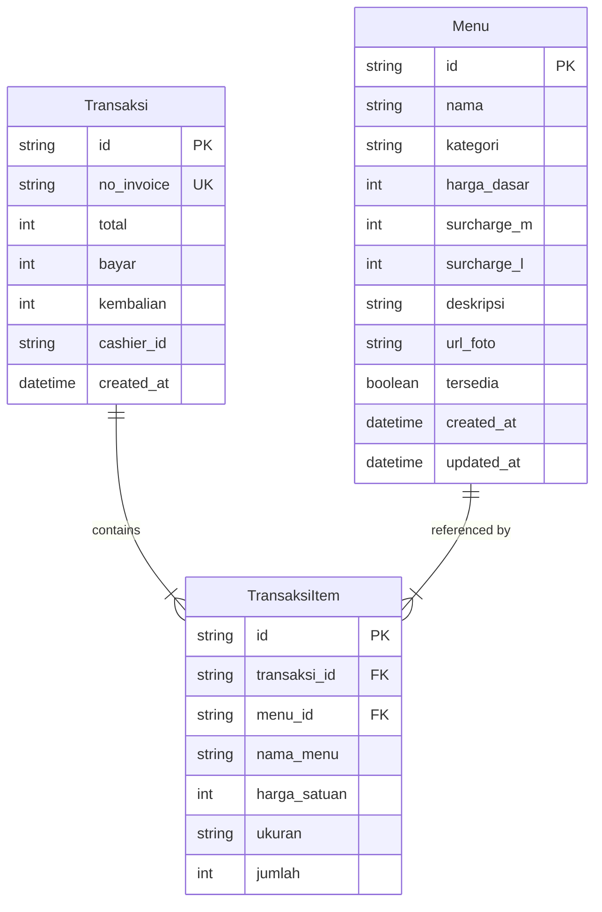

# Database Schema Design Specification

## Overview
This document specifies the database schema for the Café POS (Point of Sale) Backend, designed to run on a PostgreSQL database hosted by Supabase and managed using Prisma ORM.

## Relational Schema Diagram

## Tables & Fields Specification

### 1. `Menu` (Tabel: `menus`)
Stores the catalog of food and beverage items available in the café.

| Field Name | Prisma Type | DB Type | Constraints | Description |
|---|---|---|---|---|
| `id` | `String` | `UUID` | `PRIMARY KEY`, `default(uuid())` | Unique identifier. |
| `nama` | `String` | `VARCHAR(255)` | `NOT NULL` | Name of the menu item (min 3 chars validation at app level). |
| `kategori` | `String` | `VARCHAR(50)` | `NOT NULL` | Category: `'minuman'` or `'makanan ringan'`. |
| `harga_dasar` | `Int` | `INTEGER` | `NOT NULL` | Base price in Rupiah (corresponds to Size 'S'). |
| `surcharge_m` | `Int` | `INTEGER` | `NOT NULL`, `default(0)` | Surcharge added for size 'M'. |
| `surcharge_l` | `Int` | `INTEGER` | `NOT NULL`, `default(0)` | Surcharge added for size 'L'. |
| `deskripsi` | `String?` | `TEXT` | `NULL` | Optional description of the item. |
| `url_foto` | `String?` | `TEXT` | `NULL` | Optional external URL to the item image. |
| `tersedia` | `Boolean` | `BOOLEAN` | `NOT NULL`, `default(true)` | Availability status. |
| `created_at` | `DateTime` | `TIMESTAMPTZ` | `default(now())` | Creation timestamp. |
| `updated_at` | `DateTime` | `TIMESTAMPTZ` | `updatedAt` | Update timestamp. |

### 2. `Transaksi` (Tabel: `transaksi`)
Stores transaction headers for cashier checkouts.

| Field Name | Prisma Type | DB Type | Constraints | Description |
|---|---|---|---|---|
| `id` | `String` | `UUID` | `PRIMARY KEY`, `default(uuid())` | Unique identifier. |
| `no_invoice` | `String` | `VARCHAR(100)` | `UNIQUE`, `NOT NULL` | Human-readable receipt number (e.g., `INV-YYYYMMDD-XXXX`). |
| `total` | `Int` | `INTEGER` | `NOT NULL` | Final calculated transaction total in Rupiah. |
| `bayar` | `Int` | `INTEGER` | `NOT NULL` | Cash amount paid by the customer. |
| `kembalian` | `Int` | `INTEGER` | `NOT NULL` | Calculated change (`bayar - total`). |
| `cashier_id` | `String?` | `UUID` | `NULL` | References Supabase Auth user ID who processed the sale. |
| `created_at` | `DateTime` | `TIMESTAMPTZ` | `default(now())` | Timestamp of checkout completion. |

### 3. `TransaksiItem` (Tabel: `transaksi_item`)
Stores line items associated with each transaction. Keeps a historical snapshot of the menu state.

| Field Name | Prisma Type | DB Type | Constraints | Description |
|---|---|---|---|---|
| `id` | `String` | `UUID` | `PRIMARY KEY`, `default(uuid())` | Unique identifier. |
| `transaksi_id`| `String` | `UUID` | `FOREIGN KEY`, `NOT NULL`, `ON DELETE CASCADE` | Link to the parent transaction header. |
| `menu_id` | `String?` | `UUID` | `FOREIGN KEY`, `NULL`, `ON DELETE SET NULL` | Link to the active catalog item. Prevents breaking sales history if a menu is deleted. |
| `nama_menu` | `String` | `VARCHAR(255)` | `NOT NULL` | Historical snapshot of the menu's name at checkout. |
| `harga_satuan`| `Int` | `INTEGER` | `NOT NULL` | Historical snapshot of price paid (`harga_dasar + surcharge`). |
| `ukuran` | `String` | `VARCHAR(10)` | `NOT NULL` | Size chosen for the item (`'S'`, `'M'`, or `'L'`). |
| `jumlah` | `Int` | `INTEGER` | `NOT NULL` | Quantity purchased (min 1). |

---

## Constraints & Referential Integrity Rules
1. **`ON DELETE CASCADE` on `transaksi_id`**: If a transaction header is deleted, all its associated items must be deleted automatically.
2. **`ON DELETE SET NULL` on `menu_id`**: If a menu catalog item is deleted, the corresponding `menu_id` in past transaction items will be set to `NULL`, but the transaction record itself remains intact.
3. **Data Integrity Snapshots**: The `nama_menu` and `harga_satuan` fields inside `TransaksiItem` MUST be populated on creation using values resolved from the `Menu` model (e.g., base price + size surcharge) to prevent historic financial records from changing when menu attributes are edited.
